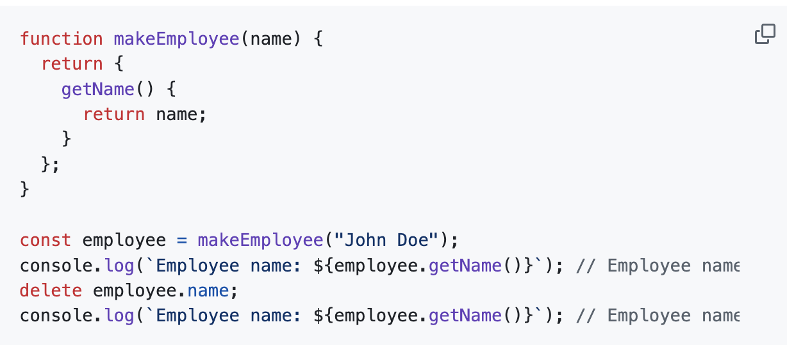
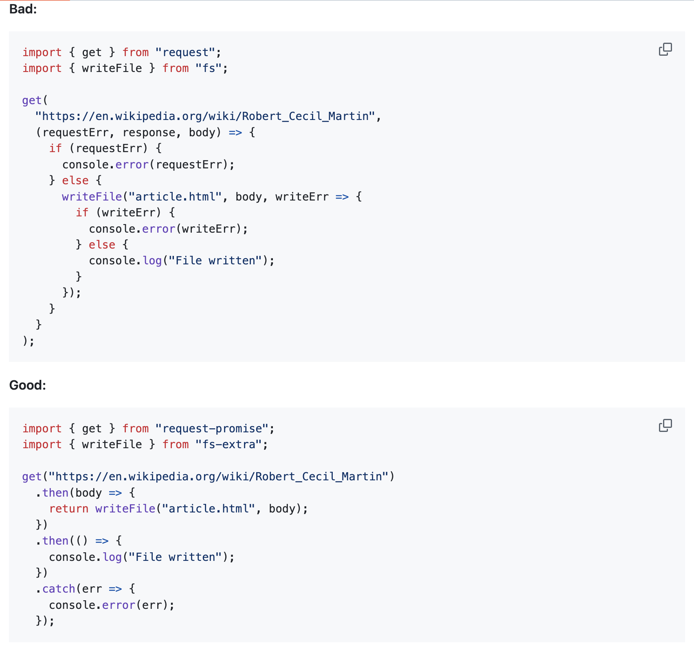

# Huisdier-Bumble

Namen van functies en variabelen. 
Taal: Engels

Format: isColor, makeAccount, newUser

Werkwoorden: get, create, make, is, delete

Eigenschappen: Name, Age, Gender, Race, Kilogram, Castration/Sterilisation

Puntkomma (;): Geen puntkomma op JavaScript

Functie: Wel met een arrow 

Commentaar: Geen oude code laten staan, Witte ruimte met nieuwe functie

If & else: Omdat if & else callbacks de fouten kunnen veroorzaken, gebruiken we return, then en catch.

Viewport: Mobiel versie

# CONCEPTUALISEREN

Tijdens het brainstormen kwamen we tot 14 creatieve ideeën.

-Event Buddy
-SkilSwap
-Huisdier Playdates
-StudieBuddy
-TravelBuddy
-BandMatch
-GymBuddy
-WandelBuddy
-BookClub
-CinephilleBuddy
-OntdekNieuweGerechten (Restaurant & persoon matchen)
-TaalMaatje
-ShopMaatje
-CultureConnect (Nieuwkomers & lokalen matchen)

Uiteindelijk hebben we ervoor gekozen om Huisdier Playdates verder uit te werken, omdat dit concept verschillende functies en ontwerpmogelijkheden biedt.

# Match op:
    - Diersoort
    - Ras
    - Leeftijd
    - Energieniveau
    - Karakter (speels, rustig, dominant)
    - Locatie
    - Gevaccineerd ja/nee
    - Gecatariseerd ja/nee
    - Interesses van de eigenaar

# Mogelijke functies
    - Huisdierprofiel (met foto)
    - Filter op ras/leeftijd
    - Filter op energieniveau
    - Afstand filter
    - Speelafspraak plannen / Chat
    - Favorieten opslaan
    - “Speelgeschiedenis”
    - Match-score op temperament
    - Reviews van andere baasjes
